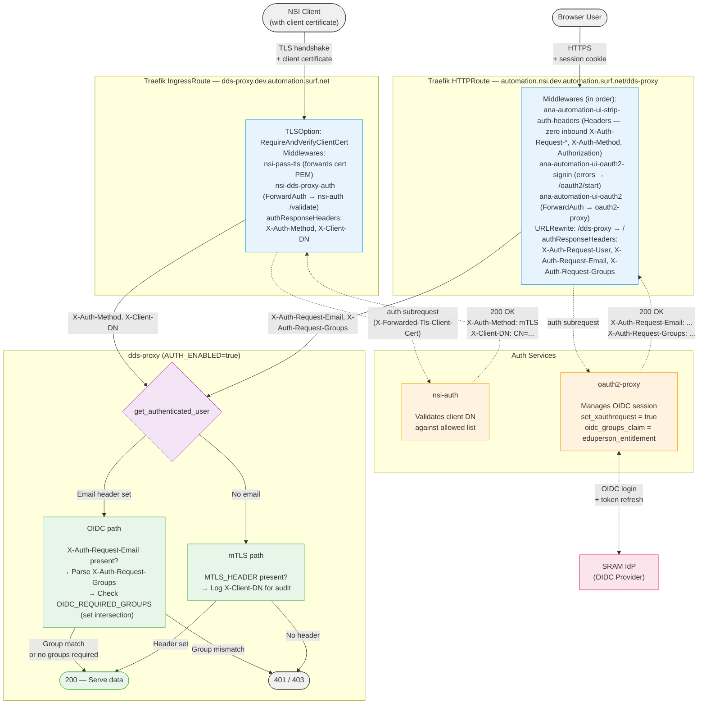

# nsi-dds-proxy

The NSI Document Distribution Service proxy offers a REST API to retrieve
topologies, switching services, service termination points, and service
demarcation points from the combined topology documents found on the DDS.  The
information returned is a subset as needed by NSI ultimate Requester Agents
like the NSI Orchestrator, SENSE, and others.

## Project ANA-GRAM

This software is being developed by the 
[Advanced North-Atlantic Consortium](https://www.anaeng.global/), 
a cooperation between National Education and Research Networks (NRENs) and 
research partners to provide network connectivity for research and education 
across the North-Atlantic, as part of the ANA-GRAM (ANA Global Resource Aggregation Method) project. 

The goal of the ANA-GRAM project is to federate the ANA trans-Atlantic links through
[Network Service Interface (NSI)](https://ogf.org/documents/GFD.237.pdf)-based automation.
This will enable the automated provisioning of L2 circuits spanning different domains 
between research parties on other sides of the Atlantic. The ANA-GRAM project is 
spearheaded by the ANA Platform & Requirements Working Group, under guidance of the 
ANA Engineering and ANA Planning Groups.  

<p align="center" width="50%">
    
</p>

## Architecture

The diagram below shows the ANA-GRAM automation stack and how the DDS Proxy fits into the broader architecture.

<p align="center">
    
</p>

**Color legend:**

| Color | Meaning |
|-------|---------|
| Purple | Existing software deployed in every participating network |
| Green | Existing NSI infrastructure software |
| Orange | Software being developed as part of ANA-GRAM |
| Yellow | Future software to be developed as part of ANA-GRAM |

**Components:**

- [**ANA Frontend**](https://github.com/workfloworchestrator) — Future management portal that will provide a comprehensive overview of all configured services on the ANA infrastructure, including real-time operational status information.
- [**NSI Orchestrator**](https://github.com/workfloworchestrator/nsi-orchestrator) — Central orchestration layer that manages the lifecycle of topologies, switching services, STPs, SDPs, and multi-domain connections. It uses the DDS Proxy for topology visibility and the NSI Aggregator Proxy as its Network Resource Manager.
- [**DDS Proxy**](https://github.com/workfloworchestrator/nsi-dds-proxy) (this repository) — Fetches NML topology documents from the upstream DDS, parses them, and exposes the data as a JSON REST API.
- [**NSI Aggregator Proxy**](https://github.com/workfloworchestrator/nsi-aggregator-proxy) — Translates simple REST/JSON calls into NSI Connection Service v2 SOAP messages toward the NSI Aggregator, abstracting NSI protocol complexity behind a linear state machine.
- [**DDS**](https://github.com/BandwidthOnDemand/nsi-dds) — The NSI Document Distribution Service, a distributed registry where networks publish and discover NML topology documents and NSA descriptions.
- [**PCE**](https://github.com/BandwidthOnDemand/nsi-pce) — The NSI Path Computation Element, which computes end-to-end paths across multiple network domains using topology information from the DDS.
- [**NSI Aggregator (Safnari)**](https://github.com/BandwidthOnDemand/nsi-safnari) — An NSI Connection Service v2.1 Aggregator that coordinates connection requests across multiple provider domains, using the PCE for path computation.
- [**SuPA**](https://github.com/workfloworchestrator/SuPA) — The SURF ultimate Provider Agent, an NSI Provider Agent that manages circuit reservation, creation, and removal within a single network domain. Uses gRPC instead of SOAP, and is always deployed together with [**PolyNSI**](https://github.com/workfloworchestrator/PolyNSI), a bidirectional SOAP-to-gRPC translation proxy.

## Prerequisites

- A valid client certificate and private key for mutual TLS authentication with the DDS server.
- Python 3.13+ (for running from source) or Docker.

## Configuration

All settings can be configured via environment variables or a `dds_proxy.env` file placed in the working directory. Environment variables take precedence over the env file.

| Variable | Default | Description |
|---|---|---|
| `DDS_BASE_URL` | `https://your-dds-server/dds` | Base URL of the upstream DDS server. |
| `DDS_CLIENT_CERT` | _(unset)_ | Path to the PEM-encoded client certificate used for mutual TLS with the DDS server. |
| `DDS_CLIENT_KEY` | _(unset)_ | Path to the PEM-encoded private key corresponding to the client certificate. |
| `DDS_CA_BUNDLE` | _(unset)_ | Path to a PEM file containing the CA certificates used to verify the DDS server. When set, replaces the system CA store entirely. |
| `CACHE_TTL_SECONDS` | `60` | How long (in seconds) the DDS response is cached before the next upstream fetch. |
| `HTTP_TIMEOUT_SECONDS` | `30.0` | Timeout (in seconds) for HTTP requests to the DDS server. |
| `LOG_LEVEL` | `INFO` | Logging verbosity. Accepted values: `DEBUG`, `INFO`, `WARNING`, `ERROR`. |
| `DDS_PROXY_HOST` | `localhost` | Interface the server binds to. Set to `0.0.0.0` to accept connections on all interfaces. |
| `DDS_PROXY_PORT` | `8000` | TCP port the server listens on. |
| `ROOT_PATH` | _(empty)_ | ASGI root path prefix. Set when serving behind a reverse proxy that strips a path prefix (e.g. `/dds-proxy`). Ensures Swagger UI loads the OpenAPI spec from the correct URL. Does not affect route matching. |

### Authentication (optional)

The DDS Proxy authenticates requests by reading identity headers set by the edge proxy. Browser users authenticate at the portal via Traefik plus oauth2-proxy against an OIDC provider; machine clients authenticate via mutual TLS with an auth subrequest service that validates the certificate's DN. The proxy reads the resulting identity headers and applies an optional group check. Authentication is **disabled by default**; when enabled, requests that arrive without trusted identity headers are rejected with 401.

#### Architecture

Two separate Traefik routes converge on the same dds-proxy instance:

- A **portal route** at `automation.nsi.dev.automation.surf.net/dds-proxy` that chains a Headers middleware (stripping inbound auth headers so clients can't self-attest), a ForwardAuth middleware to oauth2-proxy, and a URL-rewrite filter.
- An **mTLS IngressRoute** at `dds-proxy.dev.automation.surf.net` that enforces `RequireAndVerifyClientCert`, runs the `nsi-pass-tls` middleware to forward the cert, and chains the `nsi-dds-proxy-auth` ForwardAuth middleware to the `nsi-auth` validate sidecar.



#### Trust model

Authentication is performed at the edge; the proxy trusts the identity headers it receives. The cluster manifests must uphold the following invariants for that trust to hold:

- The portal HTTPRoute runs the `ana-automation-ui-strip-auth-headers` middleware **before** the ForwardAuth middleware, so a client cannot pre-set `X-Auth-Request-Email` / `-Groups` / `-Method`.
- The dds-proxy backend Service is `ClusterIP` and reachable only via the portal HTTPRoute or the mTLS IngressRoute.
- The mTLS route enforces `RequireAndVerifyClientCert` at the TLS layer.

The application logs the authenticated identity and group membership for every request to support audit.

#### Defense-in-depth measures

| Measure | Purpose |
|---|---|
| **mTLS route enforces `RequireAndVerifyClientCert`** before nsi-auth runs | Only certificates signed by a trusted CA reach the auth service |
| **nsi-auth validates DN** against an allowed list | Even with a valid cert, only pre-approved clients are authorized |
| **Portal route's strip-auth-headers middleware** zeroes inbound `X-Auth-Request-*`, `X-Auth-Method`, and `Authorization` | Clients cannot self-attest by pre-setting trusted headers |
| **Network isolation** (backend Services are ClusterIP only) | Direct in-cluster access to backends is required to bypass the edge — close that off with a NetworkPolicy when the cluster is multi-tenant |
| **`/health` is always unauthenticated** | k8s liveness/readiness probes succeed without credentials |

#### Header flow summary

| Header | Set by | Forwarded by | Consumed by |
|---|---|---|---|
| `X-Auth-Method` | nsi-auth (on 200) | Traefik IngressRoute (`authResponseHeaders`) | dds-proxy (mTLS auth check) |
| `X-Client-DN` | nsi-auth (on 200) | Traefik IngressRoute (`authResponseHeaders`) | dds-proxy (audit logging) |
| `X-Auth-Request-Email` | oauth2-proxy (`set_xauthrequest = true`) | Traefik HTTPRoute (`authResponseHeaders`) | dds-proxy (identity) |
| `X-Auth-Request-Groups` | oauth2-proxy (`set_xauthrequest = true`, `oidc_groups_claim = eduperson_entitlement`) | Traefik HTTPRoute (`authResponseHeaders`) | dds-proxy (group authorization) |

#### Configuration

| Variable | Default | Description |
|---|---|---|
| `AUTH_ENABLED` | `false` | Enable authentication on the data endpoints and on `/openapi.json` / `/docs` / `/redoc`. When `true`, every request to these paths must carry trusted identity headers (OIDC path) or the mTLS header, and must satisfy `OIDC_REQUIRED_GROUPS` when set. `/health` is always unauthenticated. |
| `MTLS_HEADER` | _(empty)_ | Header name that nsi-auth sets on successful validation (e.g. `X-Auth-Method`). When set and auth is enabled, the presence of this header counts as mTLS authentication. nsi-auth also sets `X-Client-DN`, which is logged for audit purposes. |
| `OIDC_REQUIRED_GROUPS` | `[]` | Groups required for OIDC-authenticated access. Supports comma-separated (`g1,g2`) or JSON array (`["g1","g2"]`). Use `[]` for no group check (any authenticated user is allowed). Matched against the parsed `X-Auth-Request-Groups` header (comma- or whitespace-separated). **Note:** pydantic-settings JSON-parses `list` env vars, so an empty string will cause a startup error — always use `[]` instead. |

**Authentication flow** when `AUTH_ENABLED=true`:

1. **OIDC path**: If `X-Auth-Request-Email` is present, the request is authenticated. If `OIDC_REQUIRED_GROUPS` is non-empty, the user's `X-Auth-Request-Groups` must intersect with the required groups; otherwise 403.
2. **mTLS path** (if `MTLS_HEADER` is set): If the configured header is present, the request is authenticated. The client certificate DN from `X-Client-DN` is logged for audit.
3. **Neither**: If no trusted identity is present, the request is rejected with 401.

#### Error responses

| Status | Detail | Cause |
|---|---|---|
| `401` | `Authentication required` | No trusted identity headers and no mTLS header found |
| `403` | `Insufficient group membership` | User not in any of the required groups |

A ready-to-use template is provided in `dds_proxy.env`. The application automatically reads this file from the working directory when it starts, so in most cases you only need to edit it in place.

If you want to maintain multiple configurations (e.g. for different environments), copy it and pass the copy explicitly via `docker run --env-file` or by exporting the variables in your shell:

```bash
cp dds_proxy.env production.env
# edit production.env

# Use with Docker:
docker run --env-file production.env ...

# Use in your shell (exports all non-comment lines as environment variables):
export $(grep -v '^#' production.env | xargs)
dds-proxy
```

Note that `docker run --env-file` expects plain `KEY=VALUE` lines — no `export` keyword, no quotes around values. The provided `dds_proxy.env` is already in this format.

## Running the Application

### From source with uv

Install dependencies and start the server:

```bash
uv sync
dds-proxy
```

The `dds-proxy` entry point starts a Uvicorn server using the host and port from your configuration. Make sure `dds_proxy.env` is present in the directory you run the command from, or export the required environment variables beforehand.

### With Python directly

If you have the package installed in your Python environment:

```bash
pip install .
dds-proxy
```

Or invoke Uvicorn manually, which lets you override host, port, and the number of workers:

```bash
uvicorn dds_proxy.main:app --host 0.0.0.0 --port 8000 --workers 4
```

Note that when using `uvicorn` directly, `DDS_PROXY_HOST` and `DDS_PROXY_PORT` are ignored — pass them as CLI arguments instead.

### With Docker

A pre-built image is available on the GitHub Container Registry:

```
ghcr.io/workfloworchestrator/nsi-dds-proxy:0.1.0
```

Run it directly, mounting your certificate files and passing configuration via environment variables:

```bash
docker run --rm \
  -p 8000:8000 \
  -v /path/to/your/certs:/certs:ro \
  -e DDS_CLIENT_CERT=/certs/client-certificate.pem \
  -e DDS_CLIENT_KEY=/certs/client-private-key.pem \
  -e DDS_CA_BUNDLE=/certs/ca-bundle.pem \
  -e DDS_BASE_URL=https://your-dds-server/dds \
  ghcr.io/workfloworchestrator/nsi-dds-proxy:0.1.0
```

Or pass all settings via an env file:

```bash
docker run --rm \
  -p 8000:8000 \
  -v /path/to/your/certs:/certs:ro \
  --env-file production.env \
  ghcr.io/workfloworchestrator/nsi-dds-proxy:0.1.0
```

If you prefer to build the image yourself:

```bash
docker build -t nsi-dds-proxy .
```

### On Kubernetes

Store your client certificate and key in a Secret, then reference them in a Deployment:

```bash
kubectl create secret generic dds-proxy-certs \
  --from-file=client-certificate.pem=/path/to/client-certificate.pem \
  --from-file=client-private-key.pem=/path/to/client-private-key.pem \
  --from-file=ca-bundle.pem=/path/to/ca-bundle.pem
```

```yaml
apiVersion: apps/v1
kind: Deployment
metadata:
  name: nsi-dds-proxy
spec:
  replicas: 1
  selector:
    matchLabels:
      app: nsi-dds-proxy
  template:
    metadata:
      labels:
        app: nsi-dds-proxy
    spec:
      containers:
        - name: nsi-dds-proxy
          image: ghcr.io/workfloworchestrator/nsi-dds-proxy:0.1.0
          ports:
            - containerPort: 8000
          env:
            - name: DDS_BASE_URL
              value: "https://your-dds-server/dds"
            - name: DDS_PROXY_HOST
              value: "0.0.0.0"
            - name: DDS_CLIENT_CERT
              value: "/certs/client-certificate.pem"
            - name: DDS_CLIENT_KEY
              value: "/certs/client-private-key.pem"
            - name: DDS_CA_BUNDLE
              value: "/certs/ca-bundle.pem"
          volumeMounts:
            - name: certs
              mountPath: /certs
              readOnly: true
      volumes:
        - name: certs
          secret:
            secretName: dds-proxy-certs
---
apiVersion: v1
kind: Service
metadata:
  name: nsi-dds-proxy
spec:
  selector:
    app: nsi-dds-proxy
  ports:
    - port: 80
      targetPort: 8000
```

### With Helm chart

Using the same secret as above, and the `values.yaml` as below, add an `ingress` if needed,
and install with:

```shell
helm upgrade --install --namespace development --values values.yaml nsi-dds-proxy chart
```

The chart also exposes an `envFromSecret` value that binds individual environment variables to keys of an existing Kubernetes Secret (entries with an empty `secretName` are skipped, so the list can be safely templated per environment).

```yaml
image:
  pullPolicy: IfNotPresent
  repository: ghcr.io/workfloworchestrator/nsi-dds-proxy
  tag: latest
env:
  CACHE_TTL_SECONDS: '60'
  DDS_BASE_URL: https://dds.your.domain/dds
  DDS_CA_BUNDLE: /certs/ca-bundle.pem
  DDS_CLIENT_CERT: /certs/client-certificate.pem
  DDS_CLIENT_KEY: /certs/client-private-key.pem
  DDS_PROXY_HOST: 0.0.0.0
  DDS_PROXY_PORT: '8000'
  HTTP_TIMEOUT_SECONDS: '30.0'
  LOG_LEVEL: INFO
livenessProbe:
  httpGet:
    path: /health
    port: 8000
readinessProbe:
  httpGet:
    path: /health
    port: 8000
resources:
  limits:
    cpu: 1000m
    memory: 128Mi
  requests:
    cpu: 10m
    memory: 64Mi
volumeMounts:
  - mountPath: /certs
    name: certs
    readOnly: true
volumes:
  - name: certs
    secret:
      optional: false
      secretName: dds-proxy-certs
```

## API Endpoints

### GET /topologies

Get a list of topologies found in DDS.

#### Response

```json
[
  {
    "id": "urn:ogf:network:example.domain.toplevel:2020:topology",
    "version": "2025-10-18 17:45 00:00",
    "name": "example.domain topology",
    "Lifetime": {
      "start": "2025-12-11T22:13:01+00:00",
      "end": "2025-12-18T22:13:01+00:00"
    },
  },
  ...
]
```

### GET /switching-services

Get a list of switching services found in all topologies found in DDS.

#### Response

```json
[
  {
    "id": "urn:ogf:network:example.domain.toplevel:2020:topology:switch:EVTS.ANA",
    "encoding": "http://schemas.ogf.org/nml/2012/10/ethernet",
    "labelSwapping": "true",
    "labelType": "http://schemas.ogf.org/nml/2012/10/ethernet#vlan",
    "topologyId": "urn:ogf:network:example.domain.toplevel:2020:topology"
  },
  ...
]
```

### GET /service-termination-points

Get a list of STP attached to all switching services found in all topologies.

#### Response

```json
[
  {
    "id": "urn:ogf:network:example.domain.toplevel:2020:topology:ps1",
    "name": "perfSONAR node 1",
    "capacity": 400000,
    "labelGroup": "2100-2400,3100-3400",
    "switchingServiceId": "urn:ogf:network:example.domain.toplevel:2020:topology:switch:EVTS.ANA"
  },
  ...
]
```

### GET /service-demarcation-points

Get a list of SDPs. Each SDP consists of a pair of matching STP attached to any
switching service found in all topologies.

```json
[
  {
    "stpAId": "urn:ogf:network:example.domain.toplevel:2020:topology:ps1",
    "stpZId": "urn:ogf:network:another.domain.toplevel:1999:topology:data-center-3"
  },
  ...
]
```
