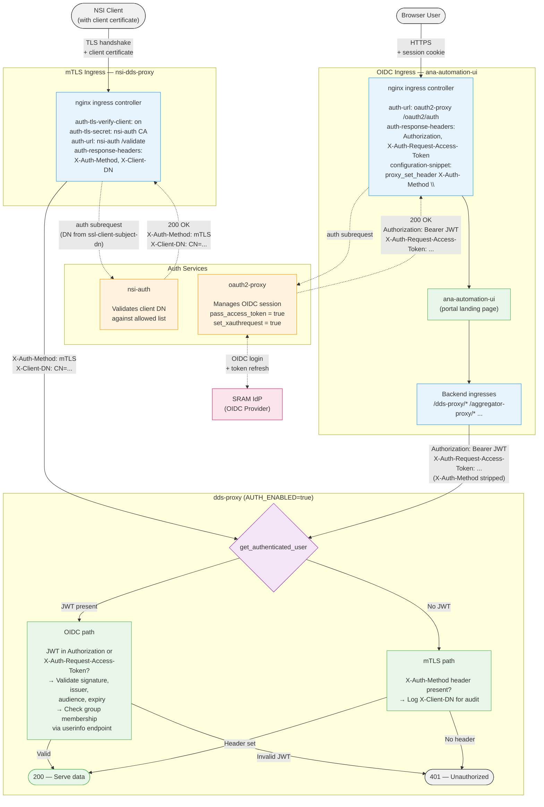

# Dual-Ingress Authentication Architecture

Two separate nginx ingresses protect the DDS Proxy API — one for **mTLS** (machine clients) and one for **OIDC** (browser users). Both converge on the same dds-proxy instance, which performs a final authentication check before serving data.

## Defense-in-Depth Measures

| Measure | Purpose |
|---|---|
| **mTLS ingress verifies client cert** against CA chain before reaching nsi-auth | Only certificates signed by a trusted CA are accepted |
| **nsi-auth validates DN** against an allowed list | Even with a valid cert, only pre-approved clients are authorized |
| **OIDC ingress strips `X-Auth-Method`** header via `configuration-snippet` | Prevents browser users from spoofing mTLS authentication by injecting the header |
| **Invalid JWT blocks request** even when `X-Auth-Method` is present | A bad JWT is always rejected — mTLS cannot rescue a failed OIDC attempt |
| **dds-proxy requires at least one method** when `AUTH_ENABLED=true` | No unauthenticated passthrough — every request must prove its identity |
| **Group-based authorization** via OIDC userinfo endpoint | OIDC users can be restricted to specific SRAM groups |

## Header Flow Summary

| Header | Set by | Forwarded by | Consumed by |
|---|---|---|---|
| `X-Auth-Method: mTLS` | nsi-auth (on 200) | mTLS nginx (`auth-response-headers`) | dds-proxy (mTLS auth check) |
| `X-Client-DN` | nsi-auth (on 200) | mTLS nginx (`auth-response-headers`) | dds-proxy (audit logging) |
| `Authorization: Bearer <JWT>` | oauth2-proxy | OIDC nginx (`auth-response-headers`) | dds-proxy (OIDC auth check) |
| `X-Auth-Request-Access-Token` | oauth2-proxy | OIDC nginx (`auth-response-headers`) | dds-proxy (JWT fallback + userinfo lookup) |
